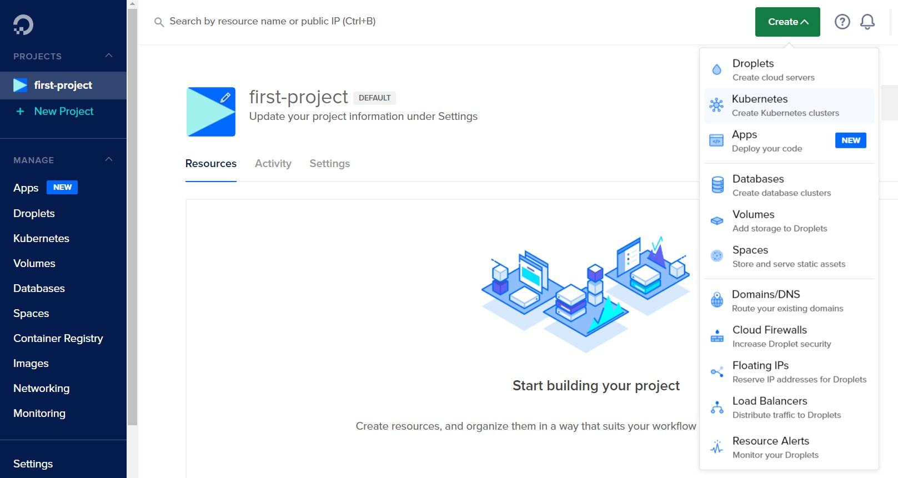
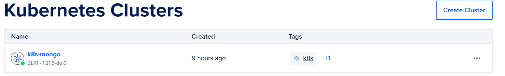
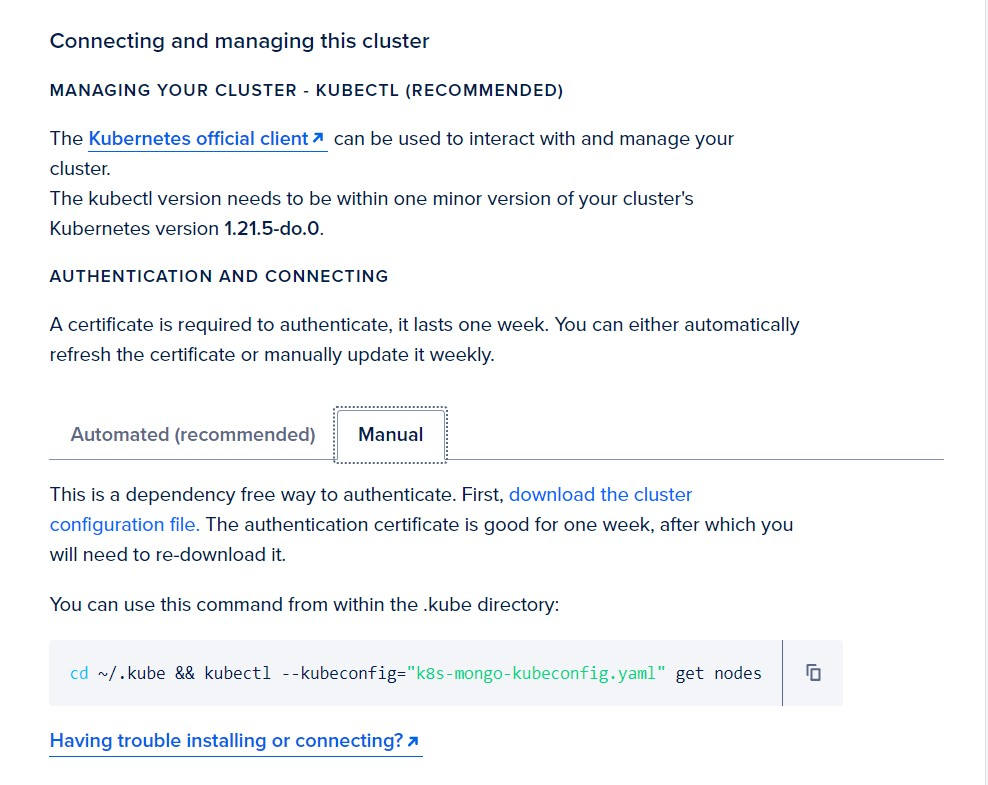
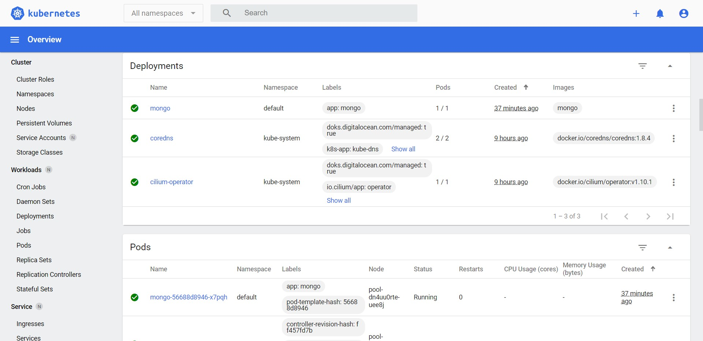
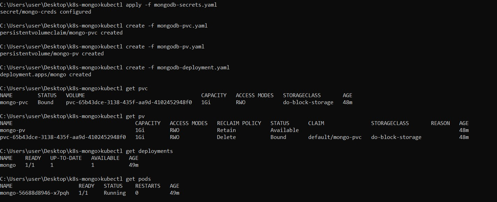

# DigitalOcean Kubernetes Challenge - Deploying a scalable NoSQL database cluster
## Introduction
Kubernetes is a powerful open-source system for managing containerized applications in a clustered environment. Its focus is to improve how related, distributed components and services are managed across varied infrastructure.

## Prerequisites
- [DigitalOcean account](https://cloud.digitalocean.com/)
- [Kubernetes CLI - kubectl](https://kubernetes.io/docs/tasks/tools/#kubectl)

## Creating a k8s cluster
After the verification of the DigitalOcean account, k8s cluster can be created from the dashboard.



- Choose the nearest datacenter region.
- Give a name for the cluster (ie, k8s-mongo)
- Leave other metrics to their default values.
- Click Create Cluster.



## Connecting to the cluster
It takes around 5 minutes for the cluster to set up. In the meantime, the cluster config file can be downloaded using,
```
cd ~/.kube && kubectl --kubeconfig="k8s-mongo-kubeconfig.yaml" get nodes
```



## Creating MongoDB secrets
Secrets in Kubernetes are the objects used for supplying sensitive information to containers. For the security of our MongoDB instance, it is wise to restrict access to the database with a password. We will use secrets to mount our desired passwords to the containers. The secrets are encoded in base64 version in the `mongodb-secrets.yaml` file.
```
apiVersion: v1
data:
  password: bW9uZ29wYXNz # mongopass
  username: a3ViZXJuZXRlcw== # kubernetes
kind: Secret
metadata:
  creationTimestamp: null
  name: mongo-creds
```

To apply the changes to our k8s cluster,
```
kubectl apply -f mongodb-secrets.yaml
```

## Creating MongoDB Persistent Volume
We require volumes to store the persistent data. In this way, even if our pod goes down, the data is not lost. There are 2 objects for creating volumes in Kubernetes.
1. Persistent Volume Claims (PVC)
2. Persistent Volumes (PV)

Create a PVC `mongodb-pvc.yaml` file,
```
apiVersion: v1
kind: PersistentVolumeClaim
metadata:
  name: mongo-pvc
spec:
  accessModes:
    - ReadWriteOnce 
  resources:
    requests:
      storage: 1Gi
```

Create the PVC using the command,
```
kubectl create -f mongodb-pvc.yaml
```

Now, we bind the PVC with a PV specified in `mongodb-pv.yaml` file,
```
apiVersion: v1
kind: PersistentVolume
metadata:
  name: mongo-pv
spec:
  accessModes:
    - ReadWriteOnce
  capacity:
    storage: 1Gi
  hostPath:
    path: /data/mongo
```

Create the PV using the command,
```
kubectl create -f mongodb-pv.yaml
```

## Deploying the MongoDB deployment
Using the official mongo image from docker hub, we create a `mongodb-deployment.yaml` file to deploy the MongoDB cluster on Kubernetes.
```
apiVersion: apps/v1
kind: Deployment
metadata:
  labels:
    app: mongo
  name: mongo
spec:
  replicas: 1
  selector:
    matchLabels:
      app: mongo
  strategy: {}
  template:
    metadata:
      labels:
        app: mongo
    spec:
      containers:
      - image: mongo
        name: mongo
        args: ["--dbpath","/data/db"]
        livenessProbe:
          exec:
            command:
              - mongo
              - --disableImplicitSessions
              - --eval
              - "db.adminCommand('ping')"
          initialDelaySeconds: 30
          periodSeconds: 10
          timeoutSeconds: 5
          successThreshold: 1
          failureThreshold: 6
        readinessProbe:
          exec:
            command:
              - mongo
              - --disableImplicitSessions
              - --eval
              - "db.adminCommand('ping')"
          initialDelaySeconds: 30
          periodSeconds: 10
          timeoutSeconds: 5
          successThreshold: 1
          failureThreshold: 6
        env:
        - name: MONGO_INITDB_ROOT_USERNAME
          valueFrom:
            secretKeyRef:
              name: mongo-creds
              key: username
        - name: MONGO_INITDB_ROOT_PASSWORD
          valueFrom:
            secretKeyRef:
              name: mongo-creds
              key: password
        volumeMounts:
        - name: "mongo-pvc-dir"
          mountPath: "/data/db"
      volumes:
      - name: "mongo-pvc-dir"
        persistentVolumeClaim:
          claimName: "mongo-pvc"
```

Create the mongo deployment using the command,
```
kubectl create -f mongodb-deployment.yaml
```

The deployment is now visible in the Kubernetes dashboard along with the pods and replica sets.



The deployment and pods can also be viewed from the terminal.



## Conclusion
We have successfully deployed a MongoDB instance on k8s cluster using DigitalOcean Kubernetes.